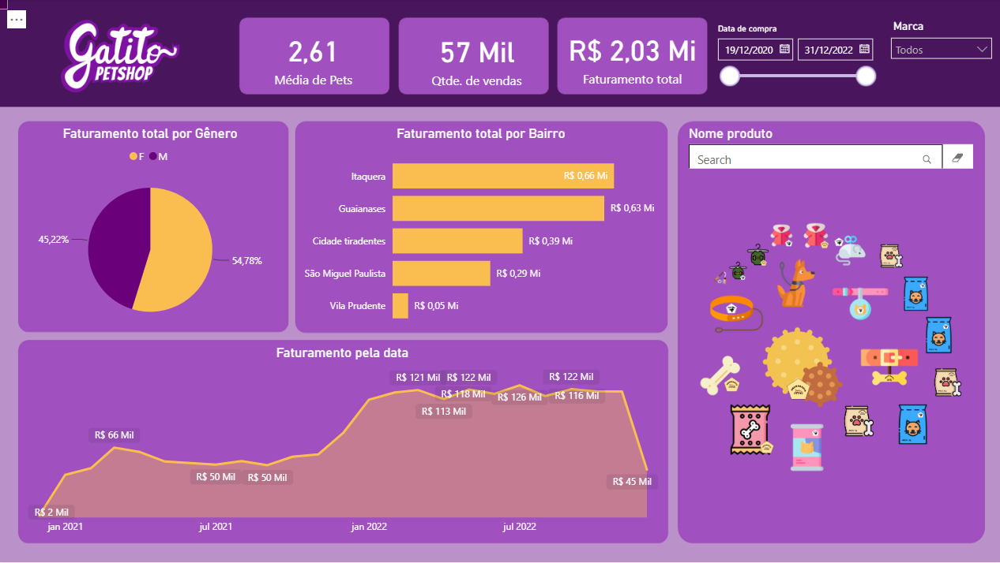

# 🐱 Projeto Power BI — Pet Shop Gatitos

## 📊 Sobre o projeto

Dashboard desenvolvido no **Power BI** para análise de dados do Pet Shop Gatitos.

O projeto apresenta informações sobre **vendas, clientes e produtos**, permitindo visualizar o desempenho do negócio e identificar padrões nos dados.

## 🎯 Objetivos

* Analisar vendas;
* Avaliar produtos e clientes;
* Comparar resultados entre 2020, 2021 e 2022;
* Criar visualizações para apoiar a análise dos dados.

## 🛠️ Tecnologias

* Power BI
* Excel
* Git
* GitHub

## 📁 Dados

O projeto utiliza dados de:

* Clientes
* Produtos
* Vendas de 2020, 2021 e 2022

## 📸 Dashboard

## 👩‍💻 Autora

**Ana Caroline Saraiva**

Projeto desenvolvido para portfólio na área de **Dados e Power BI**.
